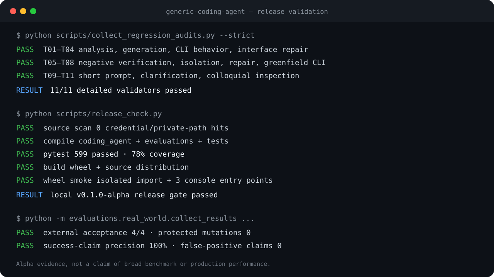
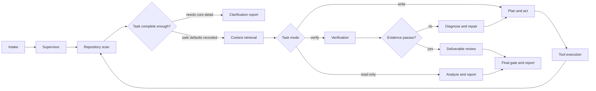

# Generic Coding Agent

[English](README.md) | [简体中文](README.zh-CN.md)

[](https://github.com/zhenmingxu1010/generic-coding-agent/actions/workflows/ci.yml)
[](https://github.com/zhenmingxu1010/generic-coding-agent/releases)
[](https://www.python.org/)
[](LICENSE)

An evidence-driven coding agent for understanding repositories, generating or
modifying code, executing verification, repairing failures, and exporting an
auditable run record.

> Status: **alpha**. The project is useful for experimentation and real-world
> demonstrations, but it should run with limited permissions and human review.



The summary records release evidence: 11/11 detailed model-backed scenarios,
599 offline tests, 78% package coverage, isolated wheel import, and the local release gate. See
[Demo](docs/DEMO.md) and
[validation transcript](docs/assets/validated-demo.txt) for reproducible steps
and accessible text.

## Why this project exists

Many coding-agent demos stop when a model says the task is complete. Generic
Coding Agent treats completion as a runtime decision: required behaviors must
be connected to executed evidence, writes must stay inside the authorized
scope, and repeated repair attempts must stop with a diagnosable result.

The project uses **LangGraph directly** for orchestration. It does not build its
workflow from LangChain chains or agents. LangGraph currently installs
`langchain-core` as a transitive dependency, but this repository does not
directly import the LangChain agent or chain APIs. Model access uses a small
OpenAI-compatible HTTP client so local vLLM servers and compatible hosted APIs
can share one configuration format.

## Capabilities

- Read-only repository analysis with path-based evidence.
- Task-intent classification and explicit read/write scope contracts.
- Short-prompt completeness checks with safe defaults, explicit assumptions,
  and resumable clarification when core behavior is missing.
- Greenfield generation and controlled changes to existing projects.
- Structured file, shell, Python, and pytest tools.
- Requirement decomposition into artifact, behavior, constraint, and quality
  atoms.
- Execution-backed verification and a deterministic final gate.
- Controlled verification of PEP 621 `[project.scripts]` console entries
  without globally allowlisting generated executable names.
- Bounded diagnosis and repair with repeated-action protection.
- Project memory, context compression, trace logs, and exportable audit bundles.
- A provider-neutral eleven-case end-to-end regression matrix.

## Architecture



The LangGraph state contains contracts, repository context, action history,
verification claims, failure evidence, repair budgets, write-scope audits, and
the final decision. See [Architecture](docs/ARCHITECTURE.md) for details.

## Quick start

Requirements: Python 3.10 or newer and an OpenAI-compatible chat-completions
endpoint.

```bash
git clone https://github.com/zhenmingxu1010/generic-coding-agent.git
cd generic-coding-agent

python3 -m venv .venv
source .venv/bin/activate
python -m pip install --upgrade pip
python -m pip install -e ".[test]"
```

Create a private model configuration:

```bash
cp configs/model.example.yaml configs/model.local.yaml
```

Edit `configs/model.local.yaml`, or set `AGENT_LLM_BASE_URL`,
`AGENT_LLM_API_KEY`, and `AGENT_LLM_MODEL`. Local configuration files are
ignored by Git.

Check model connectivity:

```bash
python -m coding_agent.check_llm
```

Run a read-only analysis:

```bash
coding-agent \
  --workspace ./path/to/project \
  --task "Analyze this repository without modifying files. Explain its architecture, entry points, tests, and risks with file evidence." \
  --thread-id demo-analysis \
  --clean-agent-state
```

Repair an existing project:

```bash
coding-agent \
  --workspace ./path/to/project \
  --repair-existing \
  --thread-id demo-repair \
  --clean-agent-state
```

Launch the interactive terminal UI:

```bash
coding-agent-chat --workspace ./path/to/project
```

Short prompts are supported. For example, `写个脚本统计文本行数` can proceed
with recorded language/layout assumptions. A prompt such as `写个脚本` stops
before source writes and returns a clarification question. Resume the same run
after answering:

```bash
coding-agent --workspace ./scratch-project \
  --thread-id short-demo --resume \
  --clarification-answer "统计指定文本文件的行数，并把整数结果打印到终端。"
```

## Model configuration

Configuration is loaded in this order:

1. `configs/model.yaml`
2. `configs/model.local.yaml`, if present
3. `AGENT_LLM_*` environment variables

The default file targets a local server at `http://127.0.0.1:8000/v1`.
Provider-specific options should remain configuration, not core task logic.

Never commit API keys. If a real key is committed or shared, revoke it rather
than only deleting the file.

## Run artifacts and audits

Agent-owned run state is written below the agent repository's ignored
`.agent_runs/` directory (or `AGENT_RUNS_DIR`), keyed by target workspace:

```text
.agent_runs/<workspace-key>/<thread-id>/
  final.json
  trace.jsonl
  messages.jsonl
  context_pack.json
  state_snapshot.json
  analysis_report.md
```

Agent-generated verification tests are isolated under
`.coding_agent_test/<thread-id>/`. Export a run for review with:

```bash
coding-agent-export-audit \
  --workspace ./path/to/project \
  --thread-id demo-repair \
  --out ./audit.zip
```

Audit export redacts common credential patterns and local absolute paths from
UTF-8 text files, and includes an `audit_manifest.json`. Bundles can still
include source excerpts, prompts, and command output; automated redaction is
defense in depth, so review every bundle before sharing.

## Development and tests

The offline suite does not require an LLM:

```bash
python -m compileall -q coding_agent tests
python -m pytest -q --cov=coding_agent --cov-report=term --cov-fail-under=75
python -m build
python scripts/release_check.py
```

The current suite reports 78% line coverage across the complete package,
including CLI modules. CI enforces a conservative 75% floor so new code cannot
silently reduce the tested surface while deeper scenario coverage continues to
grow.

The end-to-end matrix requires a configured model and creates disposable
fixtures under `.agent_runs/`:

```bash
python scripts/render_regression_matrix.py --case T01
python scripts/render_regression_matrix.py --all
```

See the [regression matrix guide](regression_matrix/README.md) for scenario
coverage and expected conditions.

## Safety boundaries

The runtime validates resolved path ancestry, skips workspace symlinks that
target external files, blocks project execution during read-only analysis, and
checks shell commands, write intent, and workspace changes. Verify-only mode
may execute project tests when the user explicitly requests verification, but
does not enable file-write tools. These controls reduce accidental damage;
they are not a sandbox for arbitrary untrusted code. Use a disposable
workspace or container, grant the least required permissions, and review
generated changes.

See [Security model](docs/SECURITY_MODEL.md) and [Security policy](SECURITY.md).

## Current limitations

- The current real-repository repair pilot is only four historical defects:
  three localized and one multi-file case. It is not a claim of broad
  SWE-bench or multi-file issue performance.
- The four-case pilot used 47 model calls and 431,051 reported tokens. External
  acceptance passed 4/4, while the Agent conservatively reported one false
  negative; the sample does not demonstrate low-cost or perfect autonomous
  verification.
- Verification is strongest for Python/pytest projects; direct POSIX shell
  scripts and standard-input scenarios are also supported.
- The in-memory LangGraph checkpointer does not persist graph state across
  process restarts; project-owned snapshots provide resume support instead.
- Context compression is structured and file-aware, but is not a full semantic
  code index.
- Model quality and OpenAI-compatible provider behavior affect task quality.
- Command and path guards are defense-in-depth, not operating-system isolation.

## Project principles

Core runtime behavior must remain provider-, repository-, domain-, and
benchmark-neutral. Compatibility fallbacks need a general failure model and
regression tests. Read [Agent principles](AGENT_PRINCIPLES.md) before proposing
architecture changes.

## Documentation

- [Architecture](docs/ARCHITECTURE.md)
- [Runbook](docs/RUNBOOK.md)
- [Security model](docs/SECURITY_MODEL.md)
- [Open-source checklist](docs/OPEN_SOURCE_CHECKLIST.md)
- [Validation record](docs/VALIDATION.md)
- [Real-world repair evaluation](docs/REAL_WORLD_EVALUATION.md)
- [Completion criteria](docs/COMPLETION_CRITERIA.md)
- [Demo guide](docs/DEMO.md)
- [Roadmap](ROADMAP.md)
- [Contributing](CONTRIBUTING.md)
- [Changelog](CHANGELOG.md)

Chinese translations use the adjacent `.zh-CN.md` filename, for example
[`docs/ARCHITECTURE.zh-CN.md`](docs/ARCHITECTURE.zh-CN.md).

## License

Apache License 2.0. See [LICENSE](LICENSE).

## 中文概览

这是一个基于 LangGraph 状态图的通用 Coding Agent。它把任务理解、写入范围、
工具执行、测试证据、失败修复和最终验收显式建模，而不是仅依赖模型自行宣布完成。
当前重点支持 Python/pytest 项目，处于 `0.1.0` alpha 阶段。
