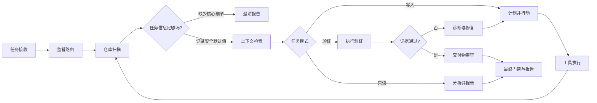

# Generic Coding Agent

[English](README.md) | [简体中文](README.zh-CN.md)

[](https://github.com/zhenmingxu1010/generic-coding-agent/actions/workflows/ci.yml)
[](https://github.com/zhenmingxu1010/generic-coding-agent/releases)
[](https://www.python.org/)
[](LICENSE)

一个证据驱动的 Coding Agent，用于理解代码仓库、生成或修改代码、执行验证、修复失败，并导出可审计的运行记录。

> 状态：**Alpha**。本项目适合实验和项目演示，但运行时应限制权限并保留人工审查。


摘要记录了当前发布证据：11/11 个详细模型场景、599 个离线测试、78% 全包覆盖率、隔离 wheel 导入和本地发布门禁。可复现步骤和无障碍文本见[演示指南](docs/DEMO.zh-CN.md)与[验证文本记录](docs/assets/validated-demo.txt)。

## 为什么创建这个项目

很多 Coding Agent 演示在模型声称“任务完成”时就停止。Generic Coding Agent 把完成状态视为运行时决策：必需行为必须连接到已执行证据，写入必须限制在授权范围内，重复修复也必须以可诊断结果有界停止。

项目直接使用 **LangGraph** 编排，而不是使用 LangChain 的 Chain 或 Agent 构建工作流。LangGraph 当前会间接安装 `langchain-core`，但本仓库不直接导入 LangChain Agent 或 Chain API。模型访问通过一个轻量 OpenAI 兼容 HTTP 客户端完成，因此本地 vLLM 服务和兼容的托管 API 可以共享同一配置格式。

## 能力

- 使用路径证据进行只读仓库分析。
- 任务意图分类和明确的读写范围契约。
- 短提示完整性检查、安全默认值、显式假设，以及核心行为缺失时可恢复的澄清。
- 从零生成项目，并受控修改现有项目。
- 结构化文件、Shell、Python 和 pytest 工具。
- 将需求拆解为产物、行为、约束和质量原子。
- 由执行证据支持的验证和确定性最终门禁。
- 在不全局放行生成命令名的前提下，受控验证 PEP 621 `[project.scripts]` 控制台入口。
- 带重复动作保护的有界诊断与修复。
- 项目记忆、上下文压缩、追踪日志和可导出审计包。
- 与模型提供商无关的 11 案例端到端回归矩阵。

## 架构



LangGraph 状态包含契约、仓库上下文、动作历史、验证声明、故障证据、修复预算、写入范围审计和最终决策。详情见[架构文档](docs/ARCHITECTURE.zh-CN.md)。

## 快速开始

要求：Python 3.10 或更新版本，以及 OpenAI 兼容的 Chat Completions 端点。

```bash
git clone https://github.com/zhenmingxu1010/generic-coding-agent.git
cd generic-coding-agent

python3 -m venv .venv
source .venv/bin/activate
python -m pip install --upgrade pip
python -m pip install -e ".[test]"
```

创建私有模型配置：

```bash
cp configs/model.example.yaml configs/model.local.yaml
```

编辑 `configs/model.local.yaml`，或设置 `AGENT_LLM_BASE_URL`、`AGENT_LLM_API_KEY` 和 `AGENT_LLM_MODEL`。本地配置文件已被 Git 忽略。

检查模型连接：

```bash
python -m coding_agent.check_llm
```

运行只读分析：

```bash
coding-agent \
  --workspace ./path/to/project \
  --task "Analyze this repository without modifying files. Explain its architecture, entry points, tests, and risks with file evidence." \
  --thread-id demo-analysis \
  --clean-agent-state
```

修复现有项目：

```bash
coding-agent \
  --workspace ./path/to/project \
  --repair-existing \
  --thread-id demo-repair \
  --clean-agent-state
```

启动交互式终端：

```bash
coding-agent-chat --workspace ./path/to/project
```

系统支持短提示。例如，`写个脚本统计文本行数` 可以在记录语言和布局假设后继续；`写个脚本` 会在写入源码前停止并返回澄清问题。回答后可以恢复同一任务：

```bash
coding-agent --workspace ./scratch-project \
  --thread-id short-demo --resume \
  --clarification-answer "统计指定文本文件的行数，并把整数结果打印到终端。"
```

## 模型配置

配置按以下顺序加载：

1. `configs/model.yaml`
2. `configs/model.local.yaml`（如果存在）
3. `AGENT_LLM_*` 环境变量

默认文件指向本地服务 `http://127.0.0.1:8000/v1`。提供商专用选项应留在配置中，而不是进入核心任务逻辑。

绝不要提交 API 密钥。如果真实密钥已被提交或共享，应立即撤销，而不是只删除文件。

## 运行产物与审计

Agent 自有运行状态按目标工作区写入 Agent 仓库中被忽略的 `.agent_runs/`（或 `AGENT_RUNS_DIR`）：

```text
.agent_runs/<workspace-key>/<thread-id>/
  final.json
  trace.jsonl
  messages.jsonl
  context_pack.json
  state_snapshot.json
  analysis_report.md
```

Agent 生成的验证测试隔离在 `.coding_agent_test/<thread-id>/`。使用下列命令导出运行记录：

```bash
coding-agent-export-audit \
  --workspace ./path/to/project \
  --thread-id demo-repair \
  --out ./audit.zip
```

审计导出会从 UTF-8 文本中脱敏常见凭证模式和本地绝对路径，并包含 `audit_manifest.json`。审计包仍可能包含源码片段、提示词和命令输出；自动脱敏只是纵深防御，分享前必须人工检查每个包。

## 开发与测试

离线套件不需要 LLM：

```bash
python -m compileall -q coding_agent tests
python -m pytest -q --cov=coding_agent --cov-report=term --cov-fail-under=75
python -m build
python scripts/release_check.py
```

当前套件对完整包（包括 CLI 模块）的行覆盖率为 78%。CI 执行保守的 75% 下限，因此新增代码不能在更深场景测试继续增长的同时静默缩小已测试范围。

端到端矩阵需要已配置模型，并在 `.agent_runs/` 下创建一次性夹具：

```bash
python scripts/render_regression_matrix.py --case T01
python scripts/render_regression_matrix.py --all
```

场景覆盖和预期条件见[回归矩阵指南](regression_matrix/README.zh-CN.md)。

## 安全边界

运行时验证解析后的路径祖先关系，跳过指向工作区外部的符号链接，在只读分析期间阻止项目执行，并检查 Shell 命令、写入意图和工作区变更。用户明确请求验证时，仅验证模式可以执行项目测试，但不会启用文件写工具。这些控制会减少意外损坏，却不是任意不可信代码的沙箱。请使用一次性工作区或容器、授予最小权限并审查生成变更。

更多内容见[安全模型](docs/SECURITY_MODEL.zh-CN.md)和[安全政策](SECURITY.zh-CN.md)。

## 当前限制

- 当前真实仓库修复试点只有 4 个历史缺陷：3 个局部案例和 1 个多文件案例，不能代表广泛 SWE-bench 或多文件 Issue 能力。
- 4 案例试点使用 47 次模型调用和 431,051 个报告 Token。外部验收 4/4 通过，但 Agent 保守地报告了 1 个假阴性；该样本不能证明低成本或完美自主验证。
- 验证对 Python/pytest 项目最强，同时支持直接 POSIX Shell 脚本和标准输入场景。
- 进程内 LangGraph 检查点不会跨进程持久化；跨进程恢复由项目快照提供。
- 上下文压缩具有结构感知和文件感知，但不是完整语义代码索引。
- 模型质量和 OpenAI 兼容提供商行为会影响任务质量。
- 命令与路径防护是纵深防御，不是操作系统隔离。

## 项目原则

核心运行时行为必须与模型提供商、仓库、领域和基准无关。兼容性回退需要通用失败模型和回归测试。提出架构变更前，请阅读 [Agent 原则](AGENT_PRINCIPLES.zh-CN.md)。

## 文档

- [架构](docs/ARCHITECTURE.zh-CN.md)
- [运行手册](docs/RUNBOOK.zh-CN.md)
- [安全模型](docs/SECURITY_MODEL.zh-CN.md)
- [开源检查清单](docs/OPEN_SOURCE_CHECKLIST.zh-CN.md)
- [验证记录](docs/VALIDATION.zh-CN.md)
- [真实仓库修复评测](docs/REAL_WORLD_EVALUATION.zh-CN.md)
- [完成标准](docs/COMPLETION_CRITERIA.zh-CN.md)
- [演示指南](docs/DEMO.zh-CN.md)
- [路线图](ROADMAP.zh-CN.md)
- [贡献指南](CONTRIBUTING.zh-CN.md)
- [变更日志](CHANGELOG.zh-CN.md)

## 许可证

Apache License 2.0，详见 [LICENSE](LICENSE)。
